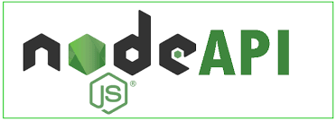

<h1 align="center">
   
</h1>
### Índice
- [Sobre](#-sobre)
- [Tecnologias utilizadas](#-tecnologias-utilizadas)
- [Como baixar o projeto](#-como-baixar-o-projeto)

---
### 👀 Sobre

Projeto do **NLW#4** para o aprendizado de backend feito em **nodeJS**.
Utilizando testes com **Jest**

---

### ⚙ Tecnologias utilizadas
- [NodeJS](https://nodejs.org/en/)
- [Express](https://expressjs.com/pt-br/)
- [TypeORM](https://typeorm.io/#/)
- [Jest](https://jestjs.io/)

---
### 📂 Como baixar o projeto

```bash
#clonar repositorio
$ git clone https://github.com/andygap/NLW#4
# entrar na pasta do projeto
$ cd NLW#4
#instalar as dependencias do projeto
$ yarn install NLW
#iniciar o projeto
$ yarn start
```